# 🍽️ Meal Tracker App

## 🚀 Project Overview
The Meal Tracker App is a simple and intuitive mobile application that allows users to log their daily meals, track calorie intake, and manage their diet efficiently. With a user-friendly interface, the app enables users to add meals with details such as name, calorie count, time , and an optional photo. Users can view their meals in a list, sort entries by criteria, and delete meals when needed, and now, explore an extended database of meals through API integration. With the latest update, users can search for meals, filter them by category, and view detailed nutritional information, enhancing their meal-tracking experience. The app also includes improved UI/UX elements, ensuring a seamless and engaging experience.


## 🌟 Screenshots

<p align="center">
  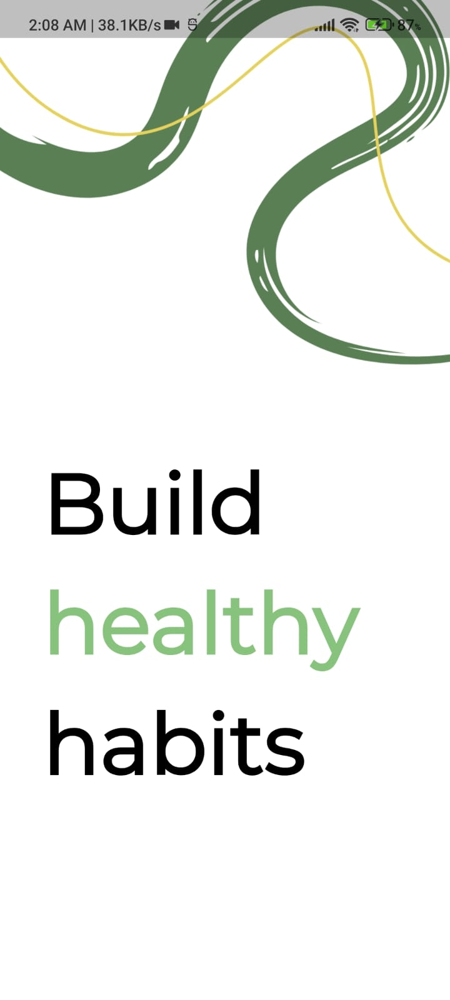
  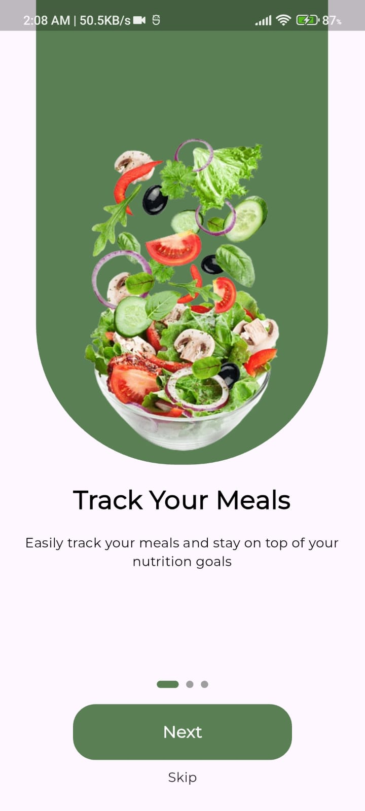
  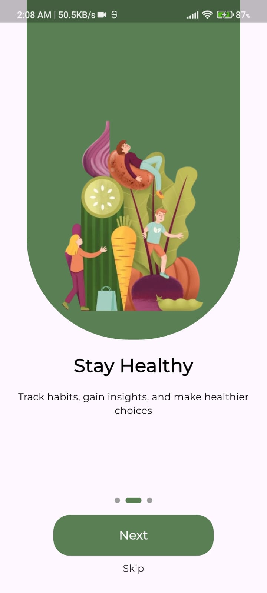
  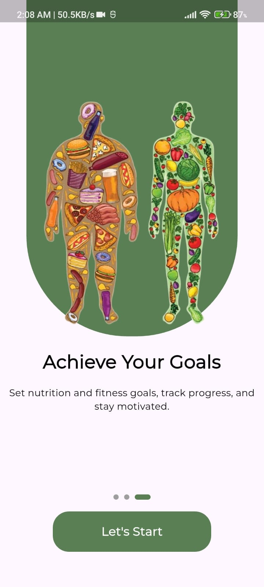
  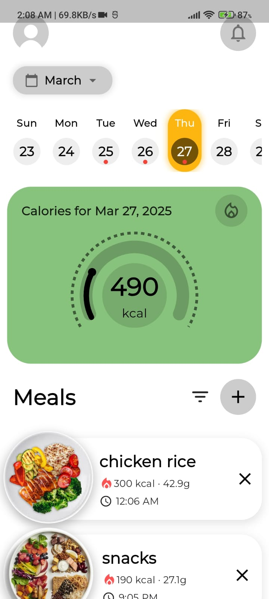
  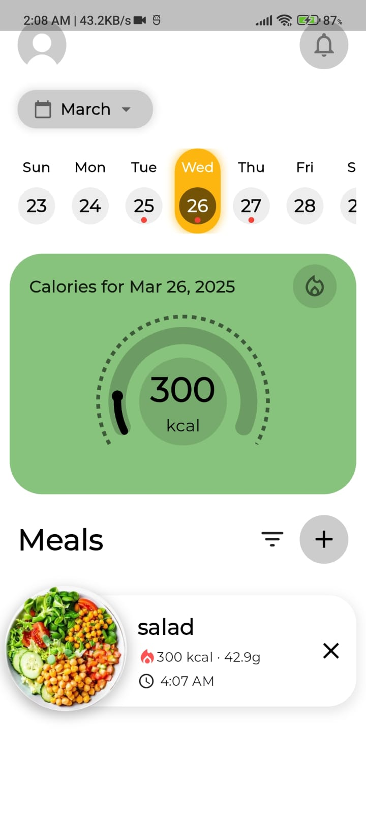
  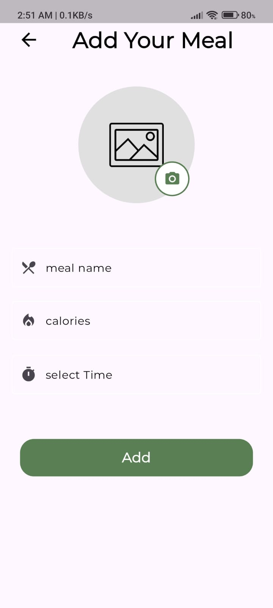
  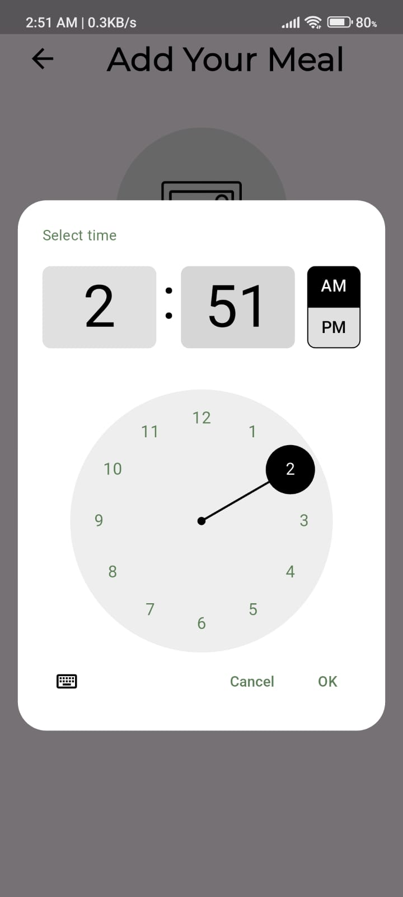
  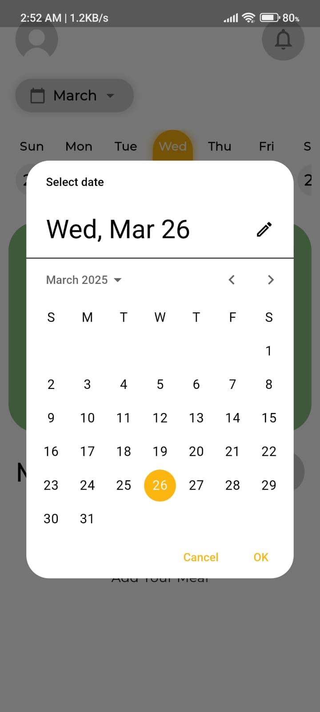
  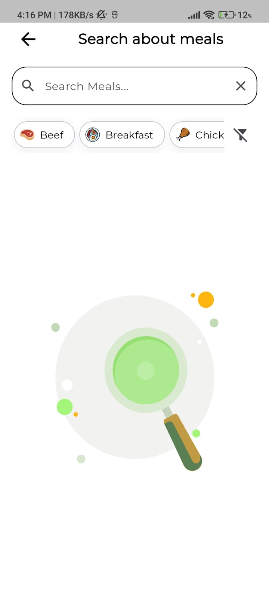
  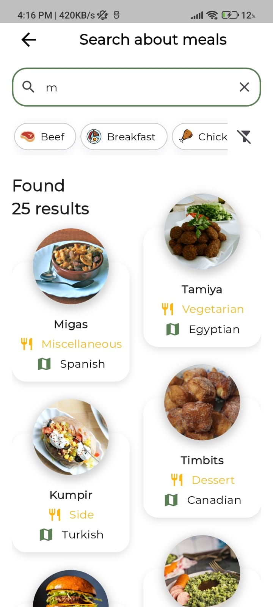
  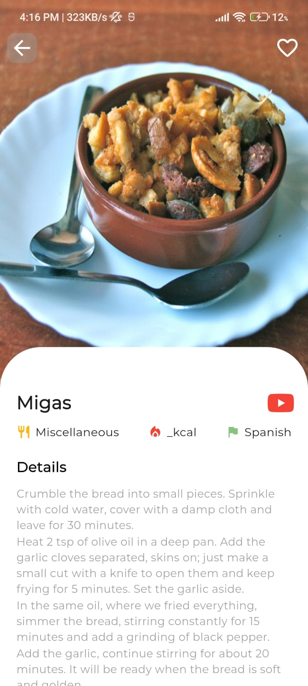
  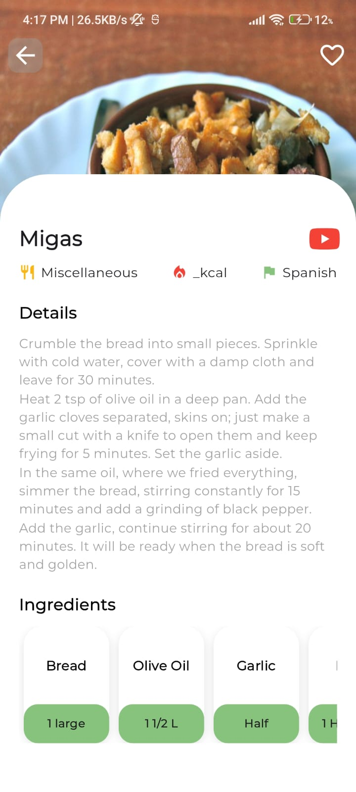
  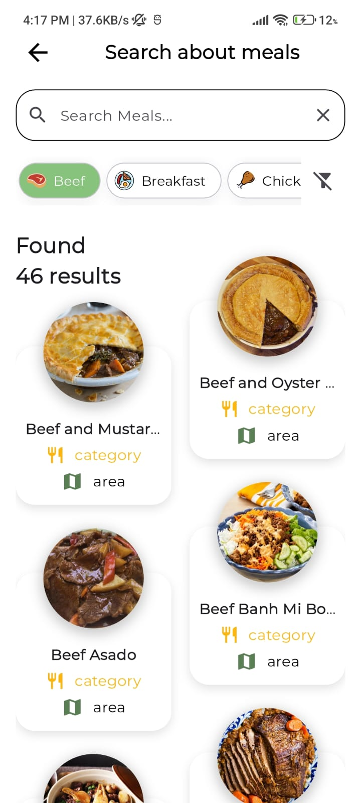
</p>

## 🎥 Demo  
🔗 [Watch the Demo](https://drive.google.com/file/d/1so451X_0O_l5tb6pg3726EUioJM_oox2/view?usp=sharing)

🔗 [Watch the new features Demo](https://drive.google.com/file/d/1t6PXFLhtor7-QhywsoeAwOlp0VPOU2o0/view?usp=sharing)
 
## 🔧 Built with

- Flutter – Cross-platform framework
- Bloc/Cubit – State management
- MVVM (Model-View-ViewModel) Architecture
- Clean Architecture – For better code structure
- Dependency Injection – Ensures modularity
- GoRouter – For efficient navigation
- Lottie – For animation loading
- Hive – Local storage for meal tracking
- Image Picker – To select images from the gallery
- Responsive Design – Using flutter_screenutil and MediaQuery for adaptability across devices
- Dio – For handling API requests


## 🎯 Features

✅ Add Meal :

- Log meals with name, calories, time, and photo.

📋 View Meals List :

- Displays all meals with daily total calories.

🔄 Sort Meals :

- Sort by name, calories, or time.

🗑️ Delete Meal :

- Remove an entry when needed.

💾 Local Storage :

- All data is stored locally for offline access.

🌐 API Integration :

- Search meals using TheMealDB API.
- Display search results with each meal’s name and thumbnail.
- View full meal details by tapping on a meal.
- Filter meals by category.

## Enhanced UI/UX

Improved visual experience with animations and modern design.
Better navigation and user-friendly interactions.

## 📱 UI & Responsiveness
Designed to be fully responsive across different screen sizes Using flutter_screenutil and MediaQuery.

## 🛠 Installation

Follow these steps to set up and run the Bookly app:

1. **Clone the repository:**
   ```sh
   git clone https://github.com/mennamohamed97/meal_tracker_app.git
   ```

2. **Navigate to the project directory:**
   ```sh
   cd meal_tracker_app
   ```

3. **Install dependencies:**
   ```sh
   flutter pub get
   ```

4. **Run the app:**
   ```sh
   flutter run
   ```


## ✨Some Resourses

A few resources to get you started if this is your first Flutter project:

-Lab: [Write your first Flutter app](https://docs.flutter.dev/get-started/codelab)

-Cookbook: [Useful Flutter samples](https://docs.flutter.dev/cookbook)

For help getting started with Flutter, view the online documentation, which offers tutorials, samples, guidance on mobile development, and a full API reference❤️


<div align="center">

# **Track Your Meals with Meal Tracker! 🍽️ ✨**

</div>

